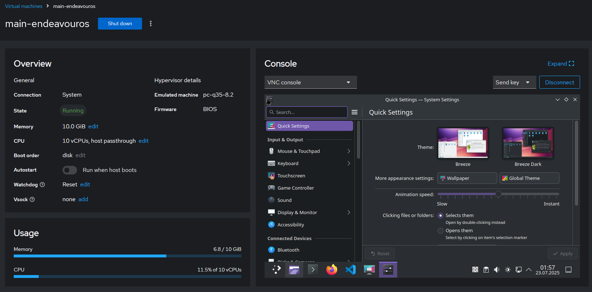
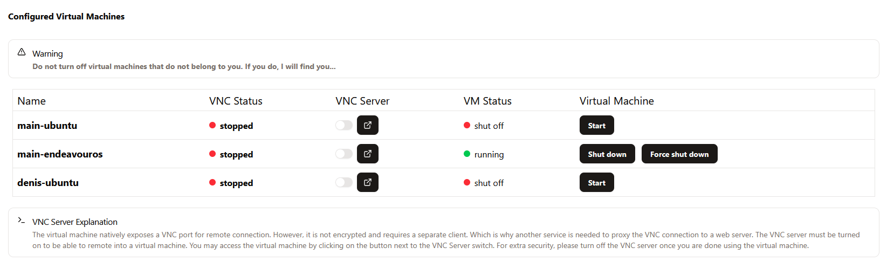

# My Home Server Setup


With what initially started as a simple set of docker-compose files for a few containers, my home server has grown into quite a comprehensive setup, complete with my own custom tools and APIs. This repo is partially for showcasing this project and partially serving as a guide for myself if I ever were to re-deploy.

## Table of contents

1. [Overview](#overview)
2. [Hardware](#hardware)  
3. [Architecture](#architecture)   
4. [Stacks & Services](#stacks--services)   
   - [Ubuntu Host & KVM VMs](#ubuntu-host--kvm-vms)  
   - [Remote‑Access Stack](#remote-access-stack)  
   - [Media‑Server Stack](#media-server-stack)  
   - [Home Assistant Stack](#home-assistant-stack) 
   - [Monitoring Stack](#monitoring-stack)  
   - [Minecraft Backup Service](#minecraft-backup-service)   
   - [Portainer & Server Manager](#portainer--server-manager)  
   - [Service Catalog](#service-catalog)
   - [Raspberry Pi](#raspberry-pi-edge) 
5. [Configuration & Secrets](#configuration--secrets)  
6. [Backups](#backups)  
7. [Monitoring & Alerts](#monitoring--alerts)  
8. [The future](#future)


## Overview
I initially bought a Raspbery Pi 4 to serve as my home server in order to self-host and have fun. As I tinkered more and more, I was pushing it to the limits so I decided to upgrade. My goals now, besides actually using the services I deploy, are to learn as much as possible about infrastructure, microservices, sysadmin, networking etc. Testing new technologies (for example migrating an API to Spring Boot to learn the framework) in a familiar environment has also proven to be a very fast way to learn in my case.

## Hardware

The hardware I am using for my home server is an Intel NUC 14 Pro with the following specs:
- Core Ultra 5 125H 4.5Ghz Meteor Lake, 4 Performance cores, 8 Efficiency cores, 2 Low Power cores, 18 total threads
- Arc Integrated Graphics
- 32GB DDR5 5600Mhz SODIMM memory
- 256GB NVMe SSD
- 1TB SATA SSD
- 2TB External HDD

I was pleasantly surprised to see that this hardware holds up really well even after adding so many virtual machines and containers. The integrated graphics are quite useful for faster-than-real-time simultaneous video transcoding in Jellyfin (see the Media Server stack). While more RAM is always useful, two VMs running at the same time can still use up to 8GB of RAM each and everything runs just fine. Storage-wise I kind of fumbled, I wish I had gotten a bigger NVMe SSD, 256GB runs out quite quickly, especially with Docker build and image cache.

## Architecture

Bare metal, the server is running ``Ubuntu Server 24.04.2 LTS``. Having no GUI was a little bit difficult at first, but has been very rewarding, as I can easily work my way around a Linux terminal.

On top of Ubuntu Server, I run two types of virtualizations: ``Kernel-based Virtual Machines (KVMs)`` and Docker containers. Some services are ran bare-metal (as ``systemctl`` services for example) if they require interaction with the host OS.

The docker containers are "informally" organized in stacks. I've tried to deploy all services pertaining to a larger category in a single ``docker-compose.yaml`` file, but I wish I used a better abstraction (see Portainer section below).

A Manager API tries to centralize all indirect interactions between services (i.e. situations where the user must intervene in the interaction), and a NextJS dashboard exposes these interactions in a single place. 

To keep track of the services I have deployed, I also wrote a super simple Software Catalog (more details in its own section).

## Stacks & Services

### Ubuntu Host & KVM VMs

#### Cockpit
A truly fantastic tool for managing the host OS is Cockpit. It's a web-based interface for Linux with a bunch of features that I use all the time. It centralizes system info like logs, storage, networking, services, accounts, software updates and more.

Where it really shines for me is in its ``libvirt`` integration. I can use Cockpit to provision Virtual Machines very fast and intuitively. I can assign storage volumes from pools, attach virtual network interfaces, create VM snapshots and so so much more.



#### VM networking

On the topic of VMs, it's worth talking about their network configuration. For my main VM, I attach a TAP device to the bridged physical network adapter, allowing the VM to receive a real IP address on my home network. It can thus access other services without having to pass through the VM NAT. For other VMs, I prefer to use a virtual network with NAT. Cockpit allows me to swap between the interfaces very easily.


#### VM remote connections
Another aspect here is the remote connection. The whole point of the virtual machine was for me to be able to use it from outside my home too. Unfortunately, the remote connection protocol, VNC, is just bad. It's not encrypted, and since it's not HTTPS-based, it forces me to port-forward one port per virtual machine.

Punching holes in my firewall is a fantastically bad idea. Somewhat fortunately, there is a solution: noVNC is an HTML VNC client that connects to a ``websockify`` instance that translates the VNC protocol traffic into websocket traffic. Therefore, after I start a virtual machine, the VNC connection is active, but cannot be accessed until a noVNC/websockify server is also activated. 



While VMs can be started from Cockpit directly, starting noVNC is annoying because it's a shell command. Moreover, if I give other people access to their own VMs on my server, they need a way to turn it on/off. The Manager API uses libvirt bindings to start/stop the virtual machine and also executes the shell commands needed to turn on/off the noVNC server, and the dashboard nicely displays these options. I never access Cockpit to start/stop my virtual machines, always the dashboard. It's very convenient.

The API uses a YAML-based description of which VM maps to which port. For example:
```yaml
name: "main-endeavouros"
novnc_port: 6092
vm_port: 5901
base_path: main-endeavouros
```

Despite all this, the setup still suffers from lag sometimes. The protocol is just plain bad, it's beyond my control. 


### Remote-Access Stack
A core philosophy I have for this server is that it's very important to minimize all attack surfaces that appear from allowing remote connections. But I do acknowledge that *some* ways to remotely connect to the server are needed. So here is what I do security-wise:

#### SSH with two-factor authentication
While completely removing password authentication is the correct way to do ssh, I have decided there might be some rare situations where I prefer password + Google Authenticator. It should still be almost as secure as key-only.

#### nginx
The strict requirement I have for the ingress nginx is no HTTP, under any circumstance. I also have a catch-all statement in the config that completely rejects the SSL handshake if the client does not provide the correct domain name. Connecting via IP only is not possible. SSL certificates are obtained from ``Let's encrypt`` using ``certbot``. DDNS is obtained from my ISP.

#### Wireguard
By design, most services are not exposed to the internet, but sometimes I do want to access them remotely. For that, I use Wireguard. Not much to say here, other that each peer has its own file in the config, so only allowed devices can connect. If I ever need to add another device as a peer, I can use my phone (with the Termius app) to SSH into the server and add it. 


#### fail2ban
Having a public active ssh connection on port 22 really gets you a lot of traffic from bots, so fail2ban just monitors for failed connection attempts and temporarily bans their IPs. I can check the banned IPs by running ``sudo fail2ban-client status sshd``.


### Media Server Stack
This stack is made up of 6 containers that manage my media library. The core service is Jellyfin, the media server and player, which mounts a directory structure that contains my movies and TV shows. I also use the *arr suite for media mangement: Radarr for movies, Sonarr for TV shows, Prowlarr as an index manager and Jellyseerr for media requests. The flow for requesting media is as follows:

``Request media from Jellyseerr --> API call to Radarr/Sonarr --> API call to Prowlarr --> API call to indexer and to qBitTorrent client.``


#### Directory structure
A specific directory structure is needed to take advantage of hardlinks and atomic moves. Since everything is a Docker container, we need to mount volumes in such a way that the containers understand they are looking at the same physical drive to allow hardlinks.
```
├── MediaLibrary
│   ├── Downloads
│   └── Media
│       ├── Movies
│       └── Shows
```
Radarr and Sonarr mount ``MediaLibrary/``, qBitTorrent mounts ``MediaLibrary/Downloads/``, Jellyfin mounts ``MediaLibrary/Media/Movies/`` and ``MediaLibrary/Media/Shows/``. This way Radarr and Sonarr see both the ``Downloads/`` folder and the ``Media/`` folder and can use hardlinks to avoid storing duplicates of files as they are transferred from ``Downloads/`` to ``Media/``.

#### Jellyfin external access
Jellyfin can run under a subpath, so nginx proxies the traffic under that subpath to the Jellyfin container.


### Home Assistant Stack
Home Assistant manages my smart lights and sensors and does automations. Wifi lights are easy enough to link to HA. For the Zigbee sensors, I use a USB dongle, then zigbee2mqtt in a container. 

### Monitoring Stack


### Minecraft backup service


### Portainer & Server Manager

#### Manager API
The manager API is a service that interacts and centralizes features that I considered essential to be in one place. Particularly, features that I wanted to interact with from outside my home network, but could not justify exposing the entire service for security/privacy reasons. For example, starting/stopping and remote connection to the VMs would be done in Cockpit, but exposing that to the internet is a very bad idea. Instead, the manager API interacts directly with ``libvirt``. 

Another use is to allow other people with appropriate credentials to interact with my server, such as friends turning on/off the Minecraft server whenever they wish.

The API is currently written in Flask, but that is subject to change in the future. I am considering migrating to Spring Boot (for educational purposes only; Flask is absolutely good enough for my use cases, maybe even better for prototyping). 

#### Dashboard

### Service Catalog
Having so many services deployed on various ports are hard to track. I often found myself forgetting which service is on which port and had to open Portainer or run ``docker ps -a`` to remember. I wanted a way to centralize them in a single place, namely my dashboard. So I wrote a super simple YAML-based service catalog. Each YAML file corresponds to a service and has details about, including ip, port, description, url and more. Then the manager API interacts with these YAML files. I will soon migrate away from a YAML-based storage to an actual MySQL database and use ORM to query it. Again, not because it's better than the YAML files, but for educational purposes. 

#### Local DNS provisioning
On the subject of forgetting ports, combining the software catalog with local DNS records is an even better solution. For example, remembering ``pihole.server.local`` is way easier than ``192.168.0.170:8080``. 
And while I do not have enough services to require programatically created DNS records, it was still a fun exercise. Here is how I did it:

In pihole I added ``*.server.local`` as a local DNS record pointing to my Raspberry Pi's IP address. Since the web UI does not allow wildcard records, I added it to the dnsmasq config (by bind mounting the config in the container).

Then, I deployed a separate nginx instance on the Raspberry Pi to act as the proxy. The nginx config has server blocks matching domain names to IP:port combo. 

The config is managed by a tiny Flask API with the following routes:
```
GET /api/services/dns
Request body: ip, port
```
This route returns the domain name provisioned for a particular IP:port combo in the request body by reading the nginx config. Returns ``404`` if there is no matched IP:port server block. 

```
POST /api/services/dns
Request body: ip, port, domain
```
This route edits the nginx config by either adding a new server block or using regex to capture an existing server block matching ip:port (if it exists) and editing it with the new dns domain requested.

Analog for ``DELETE /api/services/dns``, no domain needed in the request body. 

This API is called by the manager API, never directly, because that will cause discrepancies between the service catalog and reality. Same thing when it comes to manually editing the nginx config. 

## Configuration & Secrets
Secrets like passwords public domain names or keys are stored in .env files that are gitignored. Sample .env are provided. For situations where it's not possible to store .envs, the files themselves are gitignored and sample files are provided.

## Backups

## Monitoring & Alerts
