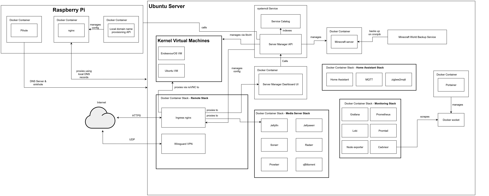

# My Home Server Setup

With what initially started as a simple set of docker-compose files for a few containers, my home server has grown into quite a comprehensive setup, complete with my own custom tools and APIs. This repo is partially for showcasing this project and partially serving as a guide for myself if I ever were to re-deploy.

## Table of contents

1. [Overview](#overview)
2. [Hardware](#hardware)  
3. [Architecture](#architecture)   
4. [Stacks & Services](#stacks--services)   
   - [Ubuntu Host & KVM VMs](#ubuntu-host--kvm-vms)  
   - [Remote‑Access Stack](#remote-access-stack)  
   - [Media‑Server Stack](#media-server-stack)  
   - [Monitoring Stack](#monitoring-stack)  
   - [Home Assistant Stack](#home-assistant-stack) 
   - [Minecraft Backup Service](#minecraft-backup-service)   
   - [Portainer & Server Manager](#portainer--server-manager)  
   - [Service Catalog](#service-catalog)
   - [Raspberry Pi](#raspberry-pi-edge) 
5. [Configuration & Secrets](#configuration--secrets)  
6. [Backups & DR](#backups--dr)  
7. [Monitoring & Alerts](#monitoring--alerts)  
8. [The future](#future)